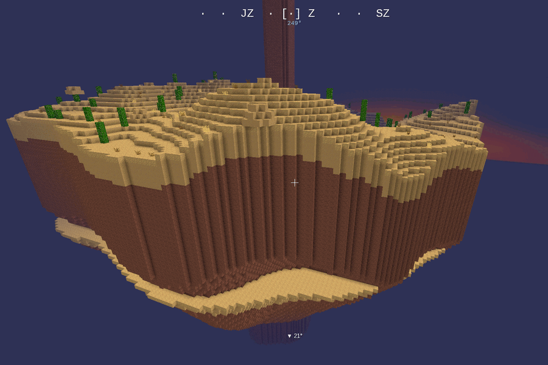

# DoggioWars ✈️

**You ARE the fighter plane.** An aerial dogfight arena set among floating
voxel islands — fly, shoot, pull aerobatic tricks and race a golden rabbit
through carved tunnels.



## The world

An endless sky filled with floating islands in **12 biomes**, generated
deterministically from the world seed:

verdant · jungle · savanna · glacial · desert · atoll · crystal ·
volcanic · ashen · barren · mycelial · swamp

Expect volcanoes with lava overflowing from the crater, waterfalls and
rivers on large green islands, lagoon atolls, giant mushrooms, glowing
crystal spires and icicled glacier mesas. Islands are **destructible** —
your shots knock pieces off, and the debris tumbles into the void.

You spawn on a home island (random biome per world) and take off
immediately — there is no walking in DoggioWars.

## Controls

Mouse-flight: the plane chases your crosshair. Steer by looking.

| Input | Action |
|---|---|
| Mouse / right stick | aim — the plane follows the crosshair |
| W / S (left stick ↑↓) | throttle / brake (speed is persistent) |
| A / D (left stick ←→) | yaw assist |
| Left mouse button, E (R2) | **shoot** |
| Right mouse button (L2) | **boost** |
| Space / Shift (X / ○) | nose up / down |
| double-tap A or D | **Barrel roll** (brief invulnerability) |
| hold Space ≥ 0.8 s | **Looping** |
| double-tap S | **Immelmann** turn |
| S + A/D | airbrake drift turn |

Steep dives build overspeed, climbing bleeds it off. Skimming close to
terrain charges your boost meter, and tricks score points.

**Gamepad**: native Luanti joystick support (Xbox 360, PS4 DualShock) —
see [GAMEPAD.md](GAMEPAD.md) for setup, the button map and
troubleshooting (in Czech).

## Chat commands

| Command | Effect |
|---|---|
| `/island` | fly to the nearest island |
| `/island <biome>` | fly above the nearest island of a biome (`ice`, `volcano`, `sand`, `green`, … or full names) |
| `/goto <x> <z>` or `/goto <x> <y> <z>` | fly to coordinates |
| `/home` | return to the home island at the origin |
| `/race` | greyhound race — chase the golden rabbit (`/race stop` to cancel) |
| `/radar` | toggle the island radar (minimap) |
| `/gp` | live gamepad diagnostics overlay |
| `/respawn_fighter` | respawn your plane |

## Installation

Install from ContentDB (Luanti main menu → Content), or clone into your
mods folder:

```
git clone https://github.com/lioilsources/DoggioWars.git doggiowars
```

Requires **Luanti 5.12+** and **Minetest Game**. Enable the mod for your
world; a singlenode-style sky world is created automatically.

## License

- Code: **MIT**
- Media (textures): **CC BY-SA 4.0**

See [LICENSE](LICENSE) for details.
